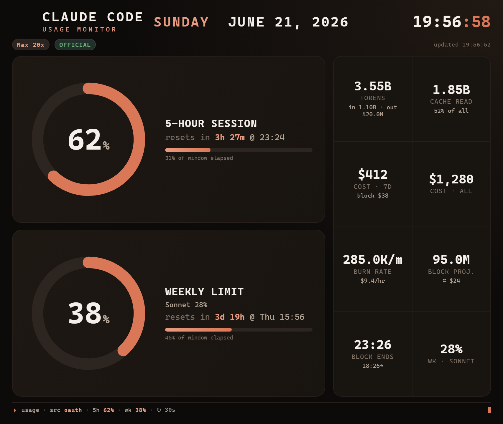

# Claude Usage — Corsair Xeneon Edge widget

A live **Claude usage dashboard**: **5-hour session** and **weekly** rings with
reset countdowns, plus tokens, cost, burn rate and block projection — styled to
feel like Claude Code.

It was built for the **CORSAIR Xeneon Edge** (iCUE dashboard), but the widget is
just a self-hosted web page — so it works **anywhere a browser does**: a second
monitor, a spare browser tab, an OBS/stream overlay, a phone on your desk, or any
other iCUE/LCD device. The Xeneon Edge is optional, not required.



## How it works

A widget on the Edge is just sandboxed HTML/JS — it can't read your Claude logs
or token directly. So there are two pieces:

```
┌─────────────────────┐      http://127.0.0.1:8787       ┌──────────────────────┐
│  collector (Node)   │  ──────────────────────────────▶ │  widget (HTML/CSS/JS) │
│  server.js          │   /usage.json  (+ serves widget)  │  on the Xeneon Edge   │
│  polls data source  │                                   │  draws the rings      │
└─────────────────────┘                                   └──────────────────────┘
```

The **collector** runs on your PC, gathers usage every few minutes, and serves it
on `127.0.0.1:8787`. The **widget** fetches that JSON and renders it.

## Data source — pick one (it's pluggable)

Set `"provider"` in `collector/config.json`:

| Provider     | What you get                                                                 | Trade-off |
|--------------|------------------------------------------------------------------------------|-----------|
| `ccusage` *(default)* | Token usage, cost, 5h block window + reset, burn rate, projection — read **100% locally** from your own Claude Code logs via [ccusage]. | Fully official/no token handling, but the % is **estimated** against a token budget; no official weekly reset. |
| `oauth`      | The **exact** 5-hour %, weekly %, per-model weekly (Opus/Sonnet) and official reset times — same numbers as `/usage`. | Calls Anthropic's **undocumented** `/api/oauth/usage` using your local OAuth token + a `claude-code` User-Agent (what community status-line tools do). Mild gray area. |

The widget shows an **OFFICIAL** or **ESTIMATED** badge so you always know which
you're looking at. In `oauth` mode it also pulls token/cost detail from ccusage
(`supplementWithCcusage`).

## Quick start

```powershell
# 1. Start the collector (leave running). Default provider = ccusage, no setup.
powershell -ExecutionPolicy Bypass -File scripts\start-collector.ps1

# 2. Easiest display path — no packaging:
#    In iCUE, add an "iFrame" widget to the Edge dashboard and point it at:
#       http://127.0.0.1:8787/
```

That's it. To switch to exact numbers, edit `collector/config.json`:
`"provider": "oauth"` and restart the collector.

## Install as a proper .icuewidget (optional)

If you'd rather import a real widget than use the iFrame widget:

```powershell
powershell -ExecutionPolicy Bypass -File scripts\pack.ps1
# -> creates Claude-Usage.icuewidget
```

Then in iCUE (v5.44+): **Widgets panel → "+" → browse to `Claude-Usage.icuewidget`**.
The packaged widget still needs the collector running (it fetches
`http://127.0.0.1:8787/usage.json`).

`pack.ps1` uses Corsair's official `icuewidget` CLI if it's installed (from the
[WidgetBuilder Kit]); otherwise it falls back to zipping the folder.

## Run the collector automatically at login

Adds a hidden launcher to your **Startup folder** (no admin required). It runs
`node server.js` with no window at **login**, so the widget populates a few
seconds after you sign in.

```powershell
powershell -ExecutionPolicy Bypass -File scripts\install-startup.ps1          # install (hidden, at login)
powershell -ExecutionPolicy Bypass -File scripts\install-startup.ps1 -Remove  # uninstall + stop running instance
```

Launcher location: `%APPDATA%\Microsoft\Windows\Start Menu\Programs\Startup\ClaudeUsageCollector.vbs`.
(A Scheduled Task was the original approach but needs admin rights; the Startup
folder method avoids that.)

## Running on macOS (and Linux)

The collector is plain Node.js, so it runs anywhere Node does — only the
auto-start scripts (`scripts\*.ps1`, `.vbs`) are Windows-specific. On a Mac you
don't need them.

**Prerequisites**

- **Node.js 18+** — `node -v` to check; install via [nodejs.org](https://nodejs.org)
  or `brew install node`.
- The **Claude Code CLI** signed in on the same machine (so the collector can
  read your local token / logs). `ccusage` mode also shells out to `npx`, which
  ships with Node.

**1. Start the collector (foreground)**

```bash
cd collector
node server.js
# leave this terminal open; it serves http://127.0.0.1:8787/
```

Check it: open `http://127.0.0.1:8787/health` — you should see
`{"ok":true,...}`. The widget itself is at `http://127.0.0.1:8787/`.

> The default `provider` is `ccusage` (fully local, no token). To get exact
> numbers, set `"provider": "oauth"` in `collector/config.json`. On macOS the
> token auto-detects at `~/.claude/.credentials.json` — same as Windows — so no
> path change is needed.

**2. Display it.** The Xeneon Edge's iCUE app is Windows-only, so on a Mac you'd
typically show the widget as:

- a **browser tab / fullscreen window** on a second monitor (`http://127.0.0.1:8787/`),
- an **OBS browser source** for stream overlays, or
- any LCD/dashboard app that accepts a URL or iFrame.

**3. Auto-start at login (optional).** Two easy options:

- **Simplest — `pm2`:**

  ```bash
  npm install -g pm2
  cd collector
  pm2 start server.js --name claude-usage
  pm2 save
  pm2 startup        # prints a command to run once so pm2 relaunches at boot
  ```

- **Native — a LaunchAgent.** Create
  `~/Library/LaunchAgents/com.wheelshub.claude-usage.plist` (adjust the two paths
  to your `node` binary — `which node` — and this repo):

  ```xml
  <?xml version="1.0" encoding="UTF-8"?>
  <!DOCTYPE plist PUBLIC "-//Apple//DTD PLIST 1.0//EN"
    "http://www.apple.com/DTDs/PropertyList-1.0.dtd">
  <plist version="1.0">
  <dict>
    <key>Label</key>           <string>com.wheelshub.claude-usage</string>
    <key>ProgramArguments</key>
    <array>
      <string>/usr/local/bin/node</string>
      <string>/Users/YOU/path/to/iCUe/collector/server.js</string>
    </array>
    <key>WorkingDirectory</key> <string>/Users/YOU/path/to/iCUe/collector</string>
    <key>RunAtLoad</key>        <true/>
    <key>KeepAlive</key>        <true/>
    <key>StandardErrorPath</key><string>/tmp/claude-usage.err.log</string>
    <key>StandardOutPath</key>  <string>/tmp/claude-usage.out.log</string>
  </dict>
  </plist>
  ```

  Then load it: `launchctl load ~/Library/LaunchAgents/com.wheelshub.claude-usage.plist`
  (unload with `launchctl unload <same path>`).

> **Linux** is the same idea: run `node server.js`, and for auto-start use `pm2`
> (above) or a user **systemd** unit (`systemctl --user enable --now`).

## Configuration (`collector/config.json`)

- `provider` — `"ccusage"` or `"oauth"`.
- `port` — default `8787`. If you change it, also update the iFrame URL (and re-pack the widget, since the packaged file targets `127.0.0.1:8787`).
- `refreshSeconds` — keep **≥ 180** for `oauth` (the endpoint rate-limits harder below that).
- `plan.blockTokenLimit` — set a token number to make the 5h ring use a fixed denominator (else it uses your largest previous 5h block).
- `plan.weeklyTokenBudget` — set a number to turn the weekly ring into a % in `ccusage` mode.
- `oauth.manualToken` / `oauth.tokenEnvVar` / `oauth.credentialsPath` — token sources (auto-detects `~/.claude/.credentials.json`).
- `oauth.userAgentVersion` — the `claude-code/<version>` string sent upstream.

## Troubleshooting

- **Widget says "Collector unreachable"** — the collector isn't running, or the port differs. Start it; check `http://127.0.0.1:8787/health`.
- **iFrame widget blank** — confirm the URL is exactly `http://127.0.0.1:8787/` (http, not https).
- **`oauth` shows 401** — token expired; run any Claude Code command to refresh it.
- **`oauth` shows 429** — raise `refreshSeconds` to ≥ 180.
- **Cost numbers look huge** — ccusage reports *API-equivalent* cost, not what your subscription actually bills.

## Layout

The widget is responsive and built for the Edge's 2560×720 (32:9) panel, but
scales to any dashboard tile size. Two rings by default; a third **Weekly · Opus**
ring appears automatically when the `oauth` provider returns per-model limits.

[ccusage]: https://github.com/ryoppippi/ccusage
[WidgetBuilder Kit]: https://docs.elgato.com/icue/widgets/
